:toc:

The INTERLIS 2 reader and writer module (ili2fme) provides FME with
access to INTERLIS 2 and INTERLIS 1 transfer files.

This documentation assumes you are familiar with FME and the INTERLIS 1 and 2
formats. For more information about FME, please read the 
https://knowledge.safe.com/page/documentation/index.html[FME documentation]. 
For more information about INTERLIS, go to https://www.interlis.ch/.

== Reader Parameters

Models::
The required INTERLIS models to read the dataset (the model name, not
the file of the model; so no extension .ili) and separated by semicolons
(;). The default value %DATA is a placeholder and means that models are
determined by inspecting the transfer file.
Models Directory::
This is the folder that contains the .ili files. These files are scanned
for INTERLIS models. You may use %XTF_DIR as a placeholder for the
folder of the data file that you will read. Also model repositories
might be specified (such as
http://models.interlis.ch/).
Multiple folders or repositories may be separated by semicolons (;).

Topics Filter::
These are the qualified names of INTERLIS topics to read (for example,
DM01.Bodenbedeckung). You can enter multiple topic names, separated by
semicolons (;). If set, other topics will be ignored.
+
This parameter can remain empty. If it is not set, all topics will be
read.

Check TID/OID Uniqueness::
  Yes::: The reader will check if the TIDs/OIDs are unique.
  No::: It will bypass this check.

Validate::
  Yes::: The reader will validate the data by using the ilivalidator.
  No::: It will bypass the validation completely.

Validate Attribute/Role Multiplicity::
	Yes::: The reader will check for mandatory but missing
	values/references.
	No::: It will bypass this validation.

Validator Configuration::
An ilivalidator configuration file to fine tune the validation. See
https://github.com/claeis/ilivalidator/blob/master/docs/ilivalidator.rst#konfiguration
for further information.

Geometry Encoding::
Defines the encoding of geometry attributes, which are not used as FME
geometry (only the first geometry attribute becomes an FME geometry).
FMEXML::: encodes as FME XML
FMEBIN::: encodes as FME Binary
FMEHEXBIN::: encodes as FME Hex Binary
OGCHEXBIN::: encodes as OGC Hex Binary

Mapping of multiple Geometry Attributes::
Defines the encoding of INTERLIS geometry attributes, in cases where the
INTERLIS class defines multiple attributes of type geometry.
EncodeAsFmeAttribute::: Only the first geometry attribute becomes an
FME geometry. Any additional INTERLIS geometry attributes are mapped to
FME attributes.
RepeatFeature::: The reader creates multiple FME features for one
single INTERLIS object; one feature per geometry attribute value of the
single INTERLIS object (any non-geometry attribute is the same in all
this cloned features).

ITF Linetable Mapping::
Applies only to INTERLIS 1 datasets.
+
Polygon::: The reader will create polygons for all SURFACE/AREA
attributes; no linetable features are created. This option requires
valid data.
Raw::: The reader will read the data as it is in the ITF transfer file.
No polygon building for SURFACE/AREA attributes will be done. This
option enables to read invalid SURFACE/AREA data, and can be used for
error analysis.
Polygon+Raw::: The reader will create polygons for all SURFACE/AREA
attributes, but will also create linetable features. AREA linetables
will contain one or two references to the features with the polygons.
This option requires valid data.

Inheritance Mapping Strategy::
Applies only to INTERLIS 2 datasets.
+
NOTE: For more information, see the
section titled Inheritance mapping strategies under 'Feature
Representation' in the Swiss INTERLIS (ili2fme) Reader/Writer section of
the Readers and Writers Manual.
+
SuperClass::: The superclass inheritance mapping strategy is applied.
SubClass::: The subclass inheritance mapping strategy is applied.

Trim Values::
Yes::: The reader will remove leading and trailing spaces from text
attributes.
No::: The reader will bypass this data cleaning.

ITF Add Default Values::
Applies only to INTERLIS 1 datasets.
+
Yes::: The reader will parse the explanation at the end of attribute
definitions that are optional. If there is no attribute value in the
data, it will add the one given in the model.
No::: The reader will not supply any default values to the data.

ITF Renumber TIDs::
Applies only to INTERLIS 1 datasets.
+
Yes::: The reader will renumber the objects so that the TID becomes
unique across the whole transfer. Any references to the renumbered
objects are changed appropriately.
No::: The reader will read the TIDs without making any changes.

ITF Read enum Values as Code::
Applies only to INTERLIS 1 datasets.
+
Yes::: The reader will read values of attributes of type enumeration as
numeric code (the same code as it appears in the ITF transfer file).
This option is not recommended and exists only for backward
compatibility reasons.
No::: The reader will map the code from the transfer file to
enumeration element name (the value as it would appear in an INTERLIS 2
transfer file). This option is recommended because it is less error
prone and offers compatibility between INTERLIS 1 and 2.

[[CreateFeatureTypesForEnumerations]]Create Feature Types For Enumerations::
Controls how FME feature types are created for INTERLIS enumerations
+
No::: No feature types are created for enumerations
SingleType::: A single additional feature type called "XTF_ENUMS" is
created and each element of all enumeration types is provided as a
feature of this feature type.
OneTypePerEnumDef::: One feature type is created for each enumeration
type.

http Proxy Host::
This is the proxy server that ili2fme will use to access model
repositories.

http Proxy Port::
This is the proxy server that ili2fme will use to access model
repositories.

Enable Trace Messages::
Controls the level of detail of log messages written by the reader.
+
Yes::: details progress messages will be written to the log
No::: only normal progress messages will be written to the log

== Writer Parameters

Models::
The required INTERLIS models to write the dataset (the model name, not
the file of the model; so no extension .ili) and separated by semicolons
(;). The default value %DATA is a placeholder and means that models are
determined by inspecting the features.

Models Directory::
This is the folder that contains the .ili files. These files are scanned
for INTERLIS models. You may use %XTF_DIR as placeholder for the folder
of the data file that you will write. Also model repositories might be
specified (such as
http://models.interlis.ch/).
Multiple folders or repositories may be separated by semicolons (;).

Check TID/OID Uniqueness::
Yes::: Checks if the TIDs/OIDs are unique.
No::: This check is bypassed.

Validate::
Yes::: The writer will validate the data by using the ilivalidator.
No::: It will bypass the validation completely.

Validate Attribute/Role Multiplicity::
Yes::: The writer will check for mandatory but missing
values/references.
No::: It will bypass this validation.

Validator Configuration::
An ilivalidator configuration file to fine tune the validation. See
https://github.com/claeis/ilivalidator/blob/master/docs/ilivalidator.rst#konfiguration
for further information.

Inheritance Mapping Strategy::
Applies only to INTERLIS 2 datasets.
+
SuperClass::: The superclass inheritance mapping strategy is applied.
SubClass::: The subclass inheritance mapping strategy is applied.

Geometry Encoding::
Defines the encoding of geometry attributes which are not used as FME
geometry (only the first geometry attribute becomes FME geometry).
+
FMEXML::: encodes as FME XML
FMEBIN::: encodes as FME Binary
FMEHEXBIN::: encodes as FME Hex Binary
OGCHEXBIN::: encodes as OGC Hex Binary

Trim Values::
Yes::: The writer will remove leading and trailing spaces from text
attributes.
No::: It will bypass this data cleaning.

Use Linetables::
This field applies only to
INTERLIS 1 datasets with INTERLIS AREA or INTERLIS SURFACE attributes.
+
Yes::: The writer will expect one additional feature type for each
INTERLIS SURFACE or AREA attribute. The additional feature type with the
suffix _$(attributeName) contains the line helper features as they
should appear in the transfer-file.
No::: The writer will create the line helper table out of the
polygons/donuts.

http Proxy Host::
This is the proxy server that ili2fme will use to access model
repositories.

http Proxy Port::
This is the proxy server that ili2fme will use to access model
repositories.

Enable Trace Messages::
Controls the level of detail of log messages written out.
+
Yes::: Detailed progress messages will be written to the log.
No::: Only normal progress messages will be written to the log.

== Feature Representation

The following clauses describe how ili2fme maps INTERLIS objects to FME
features. Features written to the INTERLIS transfer file are expected to
have the same structure, as they would have had when read.

INTERLIS allows for some nesting of type definitions. A class or table
is defined in a topic. Several topics are grouped to a model. FME does
not allow such a nesting; therefore, ili2fme maps INTERLIS class with
their qualified name to FME feature types.

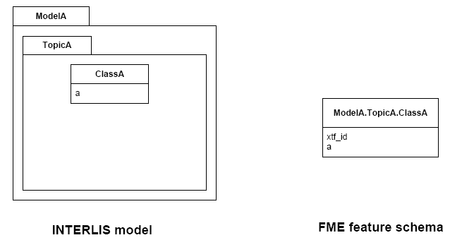

If an INTERLIS 2 data file has multiple baskets (instances of a topic;
set of objects) of the same topic or the model has extended topics,
additional format attributes are required.

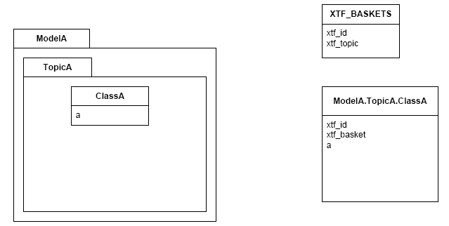

To know which feature belongs to which basket, each feature has a
reference to the basket in the format attribute xtf_basket. Each basket
is represented as an instance of the format feature type XTF_BASKETS.
The attribute xtf_topic holds the qualified topic name that describes
this basket (in this case that would be ModelA.TopicA). The attribute
xtf_id of the feature type XTF_BASKETS is the transfer identification of
the basket (BID).

=== Multiple Geometries per Class

An INTERLIS class may define multiple attributes of type geometry.

image:media/image8.png[INTERLIS model to FME schema
mapping,width=576,height=318]

ili2fme maps the first geometry of the INTERLIS class to the FME
geometry of the feature. Any additional INTERLIS geometry attributes are
mapped to existing FME attributes. The value of these attributes
(attribute _b_ in the diagram above) is HEX-encoded OGC WKB (this can be
changed with the parameter
Geometry Encoding)
and can be extracted from that attribute to the feature geometry with
the
https://www.safe.com/transformers/geometry-replacer/[GeometryReplacer]
transformer or set with the
https://www.safe.com/transformers/geometry-extractor/[GeometryExtractor]
transformer.

=== INTERLIS 1 Area

INTERLIS 1 encodes attributes of type AREA in helper table prior to the
main table. ili2fme can read these attributes in three modes:

- build polygons/donuts automatically from the line table
- read the main table and the line table as they are in the transfer file
- combination of the two cases above

Automatic polygon building works only, if the AREA attribute is the
first geometry attribute of the INTERLIS table.

With automatic polygon building, the mapping is as follows:

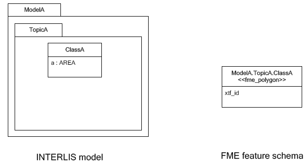

With automatic polygon build disabled, the mapping is as follows:

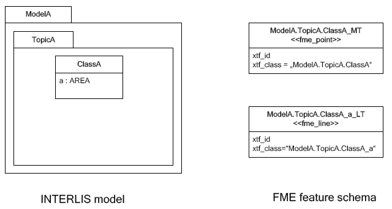

=== INTERLIS 1 Surface

INTERLIS 1 encodes attributes of type SURFACE in helper table following
the main table. ili2fme can read these attributes in three modes:

- build polygons/donuts automatically from the line table
- read the main table and the line table as they are in the transfer file
- combination of the two cases above

Automatic polygon building works only, if the SURFACE attribute is the
first geometry attribute of the INTERLIS table.

With automatic polygon building the mapping is as follows:

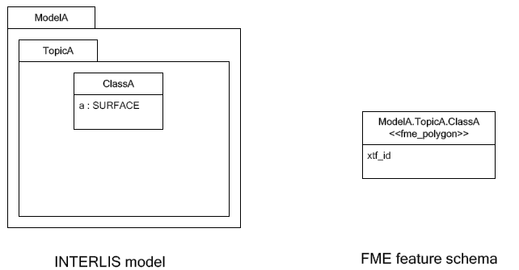

With automatic polygon build disabled, the mapping is as follows:

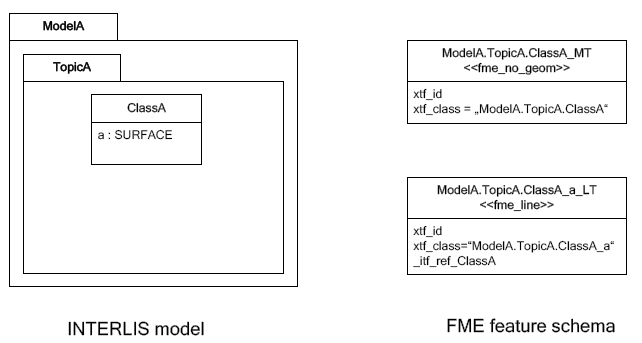

The line table (`ModelA.TopicA.ClassA_a_LT`) gets an additional
attribute (with the name of the main class; in this case
`_itf_ref_ClassA`) that is a reference from the lines to the feature in
the main table (`ModelA.TopicA.ClassA_MT`)

=== INTERLIS 2 Incremental Transfer

INTERLIS 2 supports incremental transfers (change only transfers).
Incremental transfer happens per basket. There are two kind of
incremental transfers: INITIAL and UPDATE. INITIAL is the first
transfer in a series of transfers. It includes all objects. UPDATE is
used for all succeeding transfers following INITIAL and includes only
changed objects since the last transfer. Both kinds require additional
format attributes.

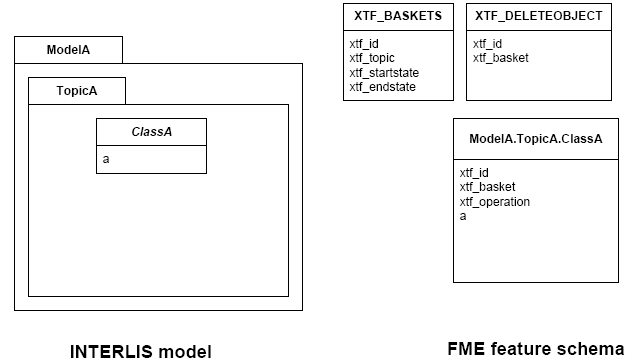

For an INITIAL data transfer, the XTF_BASKETS feature that represents
the basket has a value in the `xtf_endstate` attribute. The
`xtf_startstate` attribute should not be set. There are no
`XTF_DELETEOBJECT` features. The `xtf_operation` attribute should not be
set.

For an UPDATE data transfer, the XTF_BASKETS feature that represents the
basket has a value in the `xtf_startstate` and the `xtf_endstate`
attribute. The `xtf_startstate` value is the same as the `xtf_endstate`
of the last transfer of that basket. The `xtf_operation` attribute
should be set to `INSERT`, `UPDATE` or `DELETE`. Instead of mapping
deleted objects to ordinary features with `xtf_operation` set to
`DELETE`, they may alternatively be mapped to instances of the format
feature type `XTF_DELETEOBJECT` (without any INTERLIS attribute values;
just `xtf_id` and `xtf_basket`).

=== Inheritance Mapping Strategy

ili2fme supports to inheritance mapping strategies. Depending on your
INTERLIS model, one or the other is appropriate.

==== Superclass Strategy

Attributes of non-root classes are shifted to the root, as illustrated
by the following figure:

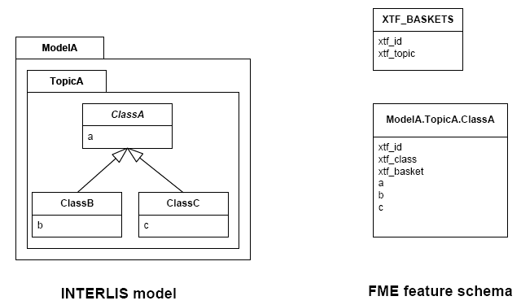

The format attribute `xtf_class` may be used to determine if a feature
is an instance of class `ModelA.TopicA.ClassB` or class
`ModelA.TopicA.ClassC`.

==== Subclass Strategy

Attributes of base classes are shifted to leafs, as illustrated by the
following figure:

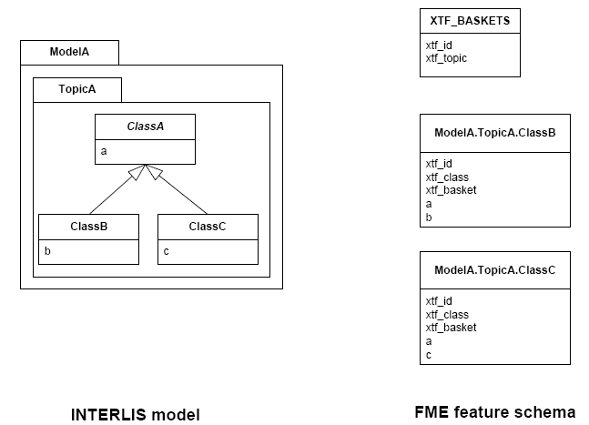

There is no feature type `ModelA.TopicA.ClassA` because it's an abstract
class in the INTERLIS model.

=== Enumerations

There are two modes to read enumerations:

SingleType:: will read all elements of all enumerations with the same
FME feature type XTF_ENUMS.

OneTypePerEnumDef:: will create one FME feature type for each
enumeration type.

==== Enumerations as a Single Feature Type

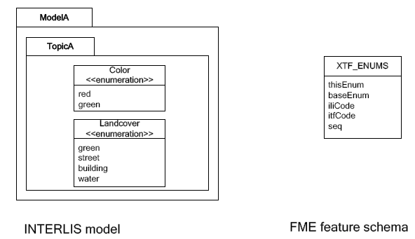

For the feature type `XTF_ENUMS`, the following features will be read:

[cols="2,1,1,1,1", options="header"]
|===
|thisEnum	             | baseEnum	|iliCode    |itfCode |seq
|ModelA.TopicA.Color     |		    | red	    | 0      |	       
|ModelA.TopicA.Color     |		    | green	    | 1      |	
|ModelA.TopicA.Landcover |		    | green	    | 0	      |
|ModelA.TopicA.Landcover |		    | street	| 1	      |
|ModelA.TopicA.Landcover |		    | building	| 2	      |
|ModelA.TopicA.Landcover |		    | water	    | 3	      |
|===

The property `baseEnum` is only defined, if the enumeration is an extended one.
The property `seq` is only set, if the enumeration is ordered.

==== One Feature Type per Enumeration

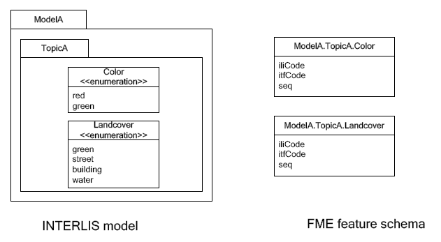

For the feature type `ModelA.TopicA.Color` the following features will
be read:

[options="header"]
|===
|iliCode  | itfCode | seq
|red      | 0       |	
|green     | 1       |
|===

=== BAG/LIST OF

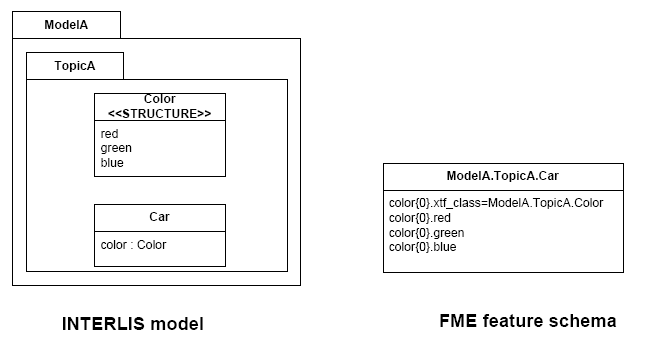

INTERLIS structure attributes (in the example the attribute "color" in
the class "Car") as well as BAG and LIST of primitive types are mapped to FME lists. 
The definition of the INTERLIS structure (in the example the structure "Color") is not mapped as a FME
feature type. The type of the structure element is defined by the value
of the attribute xtf_class (similar to the class type of objects; see
sec. Superclass Strategy), which is mandatory to be set. In the example
has the list attribute `color\{0}.xtf_class` therefore the value
`ModelA.TopicA.Color`.
Primitive types are directly mapped to according list attributes in FME and can be used as common lists. `attr1{}`.
Be aware, that the order of the objects for LIST OF needs be handled separately.

=== Multiple Geometries per Class

An INTERLIS class may define multiple attributes of type geometry.

image:media/image8.png[INTERLIS model to FME schema
mapping,width=576,height=318]

ili2fme maps the first geometry of the INTERLIS class to the FME
geometry of the feature. Any additional INTERLIS geometry attributes are
mapped to existing FME attributes. The value of these attributes
(attribute _b_ in the diagram above) is HEX-encoded OGC WKB (this can be
changed with the parameter
Geometry Encoding)
and can be extracted from that attribute to the feature geometry with
the
https://www.safe.com/transformers/geometry-replacer/[GeometryReplacer]
transformer or set with the
https://www.safe.com/transformers/geometry-extractor/[GeometryExtractor]
transformer.

=== Format Attributes

In addition to the generic FME feature attributes that FME Workbench
adds to all features (see https://docs.safe.com/fme/html/FME_Desktop_Documentation/FME_ReadersWriters/aboutFeatures/feature-type-attributes-about.htm[About Feature Attributes]), this
format also adds format-specific attributes.

[options="header"]
|===
|Attribute |Description
|xtf_id |Value of the TID XML-attribute out of the INTERLIS transfer
file. Unique across all feature types.

|xtf_class |Qualified name of the INTERLIS class name. This is different
from the feature type name in the case of non base classes. In the
figure above would ModelA.TopicA.ClassB be a possible value. If this
value is not set, the feature type name is used as the qualified
INTERLIS class name.

|xtf_basket a|
Value of the BID XML-attribute out of the INTERLIS transfer file. May be
used as foreign key to a feature of the feature type. XTF_BASKET (see
below). On writing, this may be used to write multiple baskets of the
same topic.

If writing INTERLIS 1 transfer files, this attribute is not required.

|xtf_operation |Only used for incremental INTERLIS 2 transfer. Possible
values are: INSERT, UPDATE, DELETE.

|xtf_consistency |Only used for somehow modified data. Not yet fully
supported.

|xtf_geomattr |Deprecated: Name of the geometry attribute read (e.g.
"Geometrie"). An INTERLIS class may define multiple geometry attributes.
|===

=== Format Features

The reader creates additional feature types, and the writer expects this
feature types as well. If writing INTERLIS 1 transfer files, these
feature types are not required.

==== XTF_TRANSFER

Content of the INTERLIS 2 transfer file header section.

[options="header"]
|===
|Attribute |Description
|oidspace{} |Content from the `<OIDSPACES>` element from the header
section of the transfer file.

|oidspace{}.name |For each OID domain used in this INTERLIS 2
transfer file, an alias name (as used in this transfer file).

|oidspace{}.oiddomain |Qualified name of the INTERLIS 2 OID domain
definition.

|comment |Content of `<COMMENT>` element from the header section of the
transfer file.
|===

==== XTF_BASKETS

[options="header"]
|===
|*Attribute* |*Description*
|xtf_id |For each basket in the INTERLIS 2 transfer file, the value of
the `BID` XML-attribute.

|xtf_topic |Qualified name of the INTERLIS 2 topic name. In the figure
above would `ModelA.TopicA` be a possible value.

|xtf_startstate |Only used for incremental INTERLIS 2 transfer. If set,
it indicates an `UPDATE` transfer. It indicates an `INITIAL` transfer, if it
is not set. If it is not an incremental transfer, the value is ignored.

|xtf_endstate |Only used for incremental INTERLIS 2 transfer. If set, it
indicates an incremental transfer. If it is not set, this is not an
incremental transfer.

|xtf_consistency |Only used for somehow modified data. Not yet fully
supported.
|===

==== XTF_DELETEOBJECT

[options="header"]
|===
|Attribute |Description
|xtf_id |Value of the `TID` XML-attribute out of the INTERLIS transfer
file. Unique across all feature types.

|xtf_basket |Value of the `BID` XML-attribute out of the INTERLIS transfer
file. May be used as foreign key to a feature of the feature type
`XTF_BASKET`. On writing, this may be used to write multiple baskets of
the same topic.
|===

==== XTF_ENUMS

This feature type is only created by the reader if the parameter
<<CreateFeatureTypesForEnumerations>> is set to *SingleType*.

[options="header"]
|===
|Attribute |Description
|thisEnum |Qualified INTERLIS name of the enumeration definition of this
element.

|baseEnum |Qualified INTERLIS name of the base enumeration definition of
this element. This is only set, if the enumeration is `EXTENDED`.

|iliCode |Qualified INTERLIS Name of the enumeration element. Same as it
would appear in an INTERLIS 2 transfer file (XTF).

|itfCode |Code of the enumeration element as it would appear in an
INTERLIS 1 transfer file (ITF).

|seq |Ordering position of the element. Only set, if this enumeration is
`ORDERED`.
|===

==== XTF_ERRORS

Errors from the reader.

[options="header"]
|===
|Attribute |Description
|iliname |Qualified name of the INTERLIS 2 model element that is related
to the message

|message |Error message

|tid{} |``TID``s of the objects related to the message
|===

== Limitations

- custom line forms
- XTF line attributes
- recursive structure attributes

== License
* ili2fme is licensed under the LGPL (Lesser GNU Public License).
* Some libraries used by ili2fme are licensed under MIT/X.
* Some libraries used by ili2fme are licensed under Apache 2.0.
* Some libraries used by ili2fme are licensed under a library specific
  license.
* ili2fme includes software developed by The Apache Software Foundation
  (http://www.apache.org/).

== Installation

[NOTE]
====
* Please note that Safe Software
distributes the ili2fme format with FME as a convenience.
* The https://www.safe.com/pricing/fme-desktop/[Licensing
options] for this format begin with FME Desktop Professional Edition.
====

=== Requirements

For the current version of ili2fme, you will need a JRE (Java Runtime Environment) installed on your system, version 1.6.0 or later.
The JRE (Java Runtime Environment) can be downloaded for free from the Website http://www.java.com/.

=== Files

To install ili2fme, choose a directory and extract the distribution file there.
Copy the files and subdirectories of `${ili2fme}/FME Suite` to your FME directory.
Add your standard INTERLIS models to the directory `${FME}/plugins/interlis2/ilimodels`.
At runtime, ili2fme requires the following files:

	${FME}/plugins/ili2c.jar
	${FME}/plugins/ili2fme.jar
	${FME}/plugins/jts-core-1.14.0.jar
	${FME}/metafile/ch.ehi.fme.Main.fme
	${FME}/formatsinfo/interlis2.db

=== Configuration

To use ili2fme with the FME Universal Viewer, FME requires you to set an environment variable: `FME_VIEWER_THREADING=SINGLE`.
ili2fme doesn’t use or require any windows registry entries or user settings file.

=== How to migrate/update an existing ili2fme installation

Just copy the files and subdirectories of the new `${ili2fme}/FME Suite` to your FME directory.
Starting with ili2fme version 4.0, there is no longer a native part required. 
You may delete the files `iom_fme.dll` and `xerces-c_2_6-interlis2.dll` (from previous ili2fme versions).
You must delete the file `jts-1.8.jar` and `jts-1.13.jar`. They are in conflict with `jts-core-1.14.0.jar` 
and result in a error 
	
	tried to access field com.vividsolutions.jts.geom.LineString.points from class ch.interlis.iom_j.itf.impl.jtsext.geom.CompoundCurveRing
